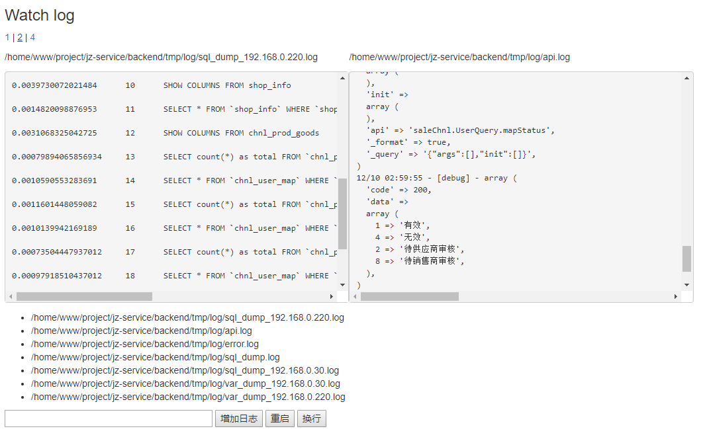

# 概述

用来监听服务器日志文件的变化, web版多文件同屏的 tail -f file效果,  
主要用来像我一样喜欢开发调试基于日志文件



注意: 可以增加任何文件监听, 为了您的安全请用于测试环境下运行, 或是自行增加防火墙规则安全访问

## install

```
composer install stcer/j-watch-log:*
```

## config

创建配置文件设置相关参数, 配置logs监听多个日志文件, 

使用 --config configFilePath 设置配置文件路径,  
默认配置文件 project_root/config-watchLog.php

```php
<?php

return [
    'server' => '0.0.0.0',
    'port' => 9504,
    'logs' => [
        __DIR__ . '/tmp/test.log'
    ]
];
```

## usage

php vendor/bin/WatchLog.php -h

```
php WatchLog.php [options]

Options:
    -h, print this message
    -v, debug mode
    
    -d, run as a daemonize mode
    -a <action>, 
        stop: stop the server 
        restart: restart the server
    
    --config value, config file path, 
        default: project_root/config-watchLog.php

```

## 访问

http://your_server:port


## todo

1. 增加日志到用户监控
1. 增加客户端收集远程主机日志